# Food Story Analytics Sales

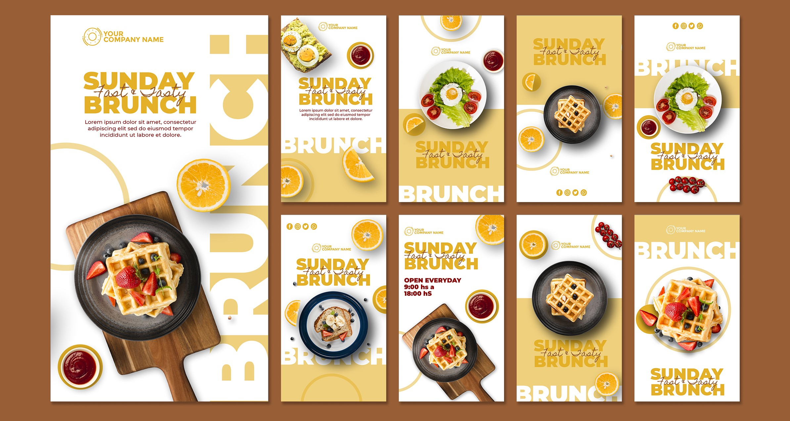

## Introduction
This project revolves around analyzing sales data for Food Story, utilizing Power BI and DAX for comprehensive insights. The objective is to enhance decision-making processes and identify opportunities for revenue growth.

## Problem Statement
Understanding sales trends, customer preferences, and peak ordering times is crucial for optimizing business strategies. The project addresses these challenges through data analysis and visualization.

## Skills Demonstrated
- Power BI Dashboard Design
- Data Analysis Expressions (DAX) Utilization
- Page Navigation
- Filters
- Button
- Data Transformation Techniques
- Data Claning
- Modeling for Insightful Analytics
- Effective Data Visualization Strategies

## Data Sourcing
The dataset for this project was sourced from Refocus, providing comprehensive sales information for Food Story.

## Data Transformation
The dataset underwent transformation to clean, reshape, and prepare it for analysis. This included handling missing data, creating new features, and formatting columns for consistency.

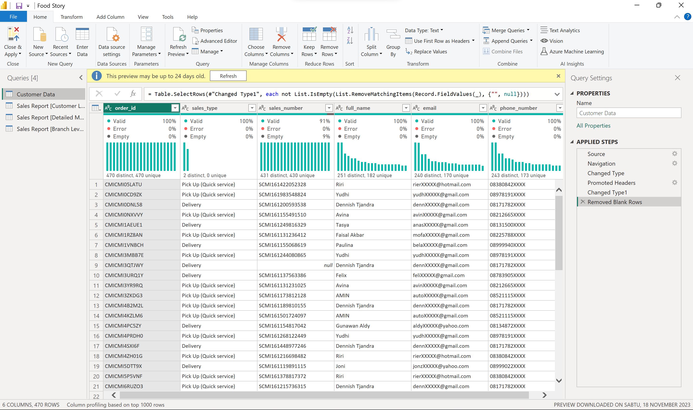

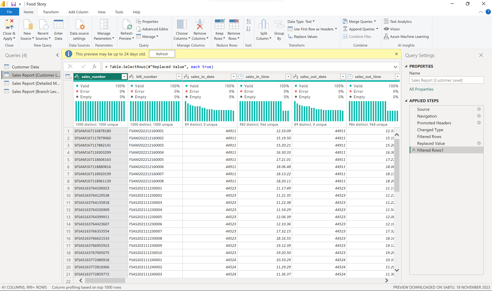

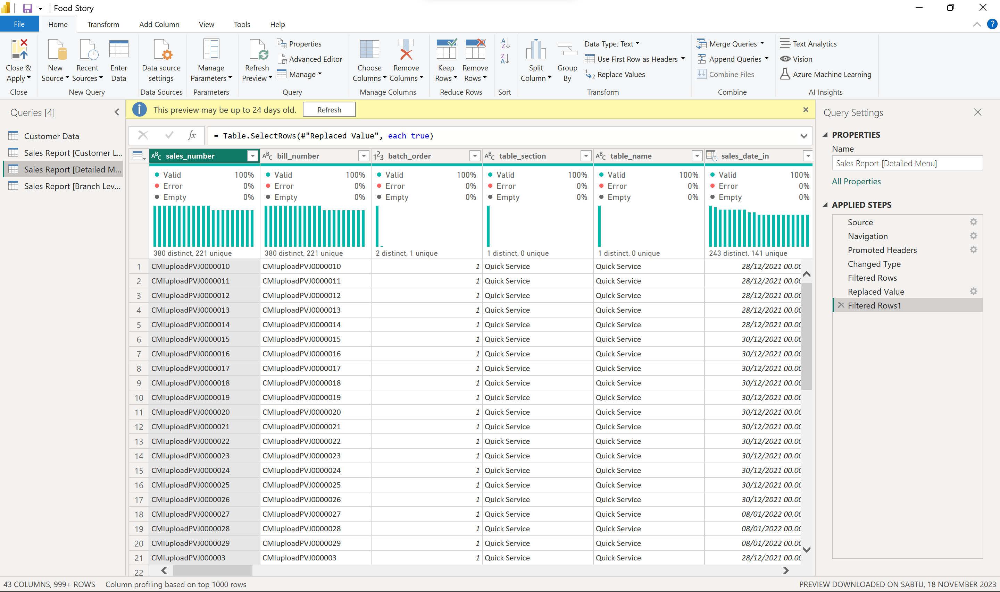

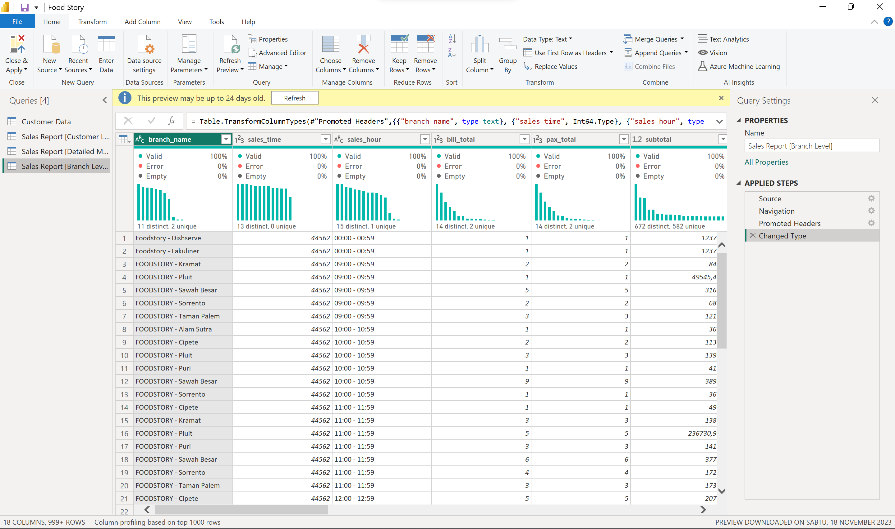

## Modeling
Utilizing DAX, various measures and calculations were implemented to derive meaningful insights. This involved creating measures for total revenue, total orders, and other key performance indicators.

### In this project there is no relationship between tables

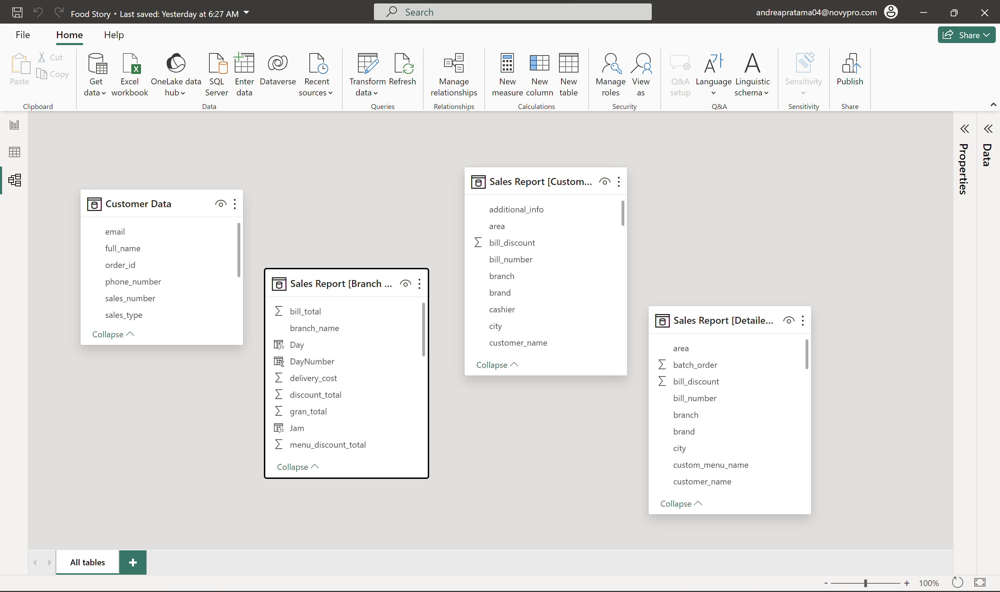

## Dax that I used in this project ( Measure & Create New Column )

### Create Measure

- Customer Data 

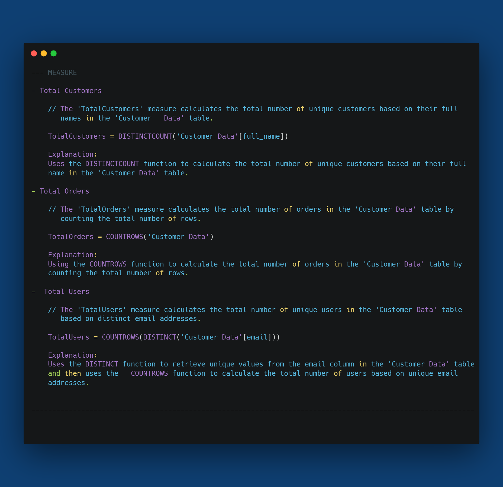

- Branch Level

  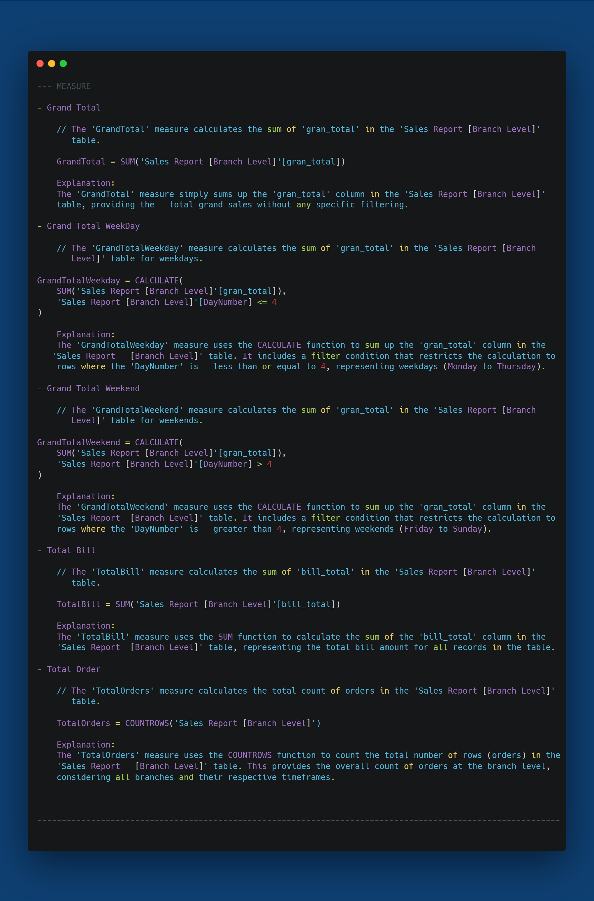

- Menu Level

  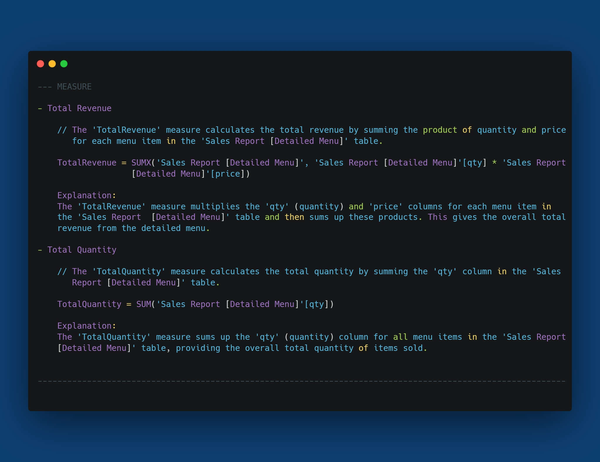

- Customer Level

  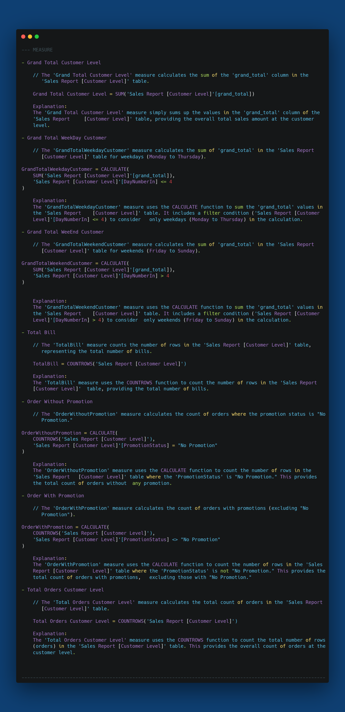

### Create New Column

- Branch Level

  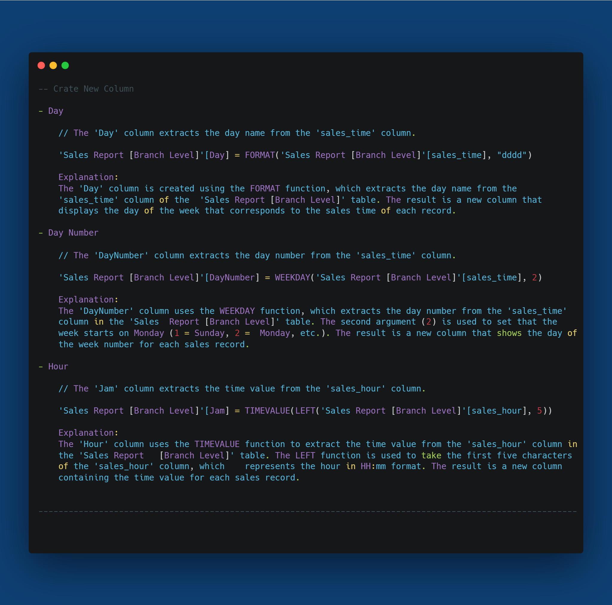

- Customer Level

  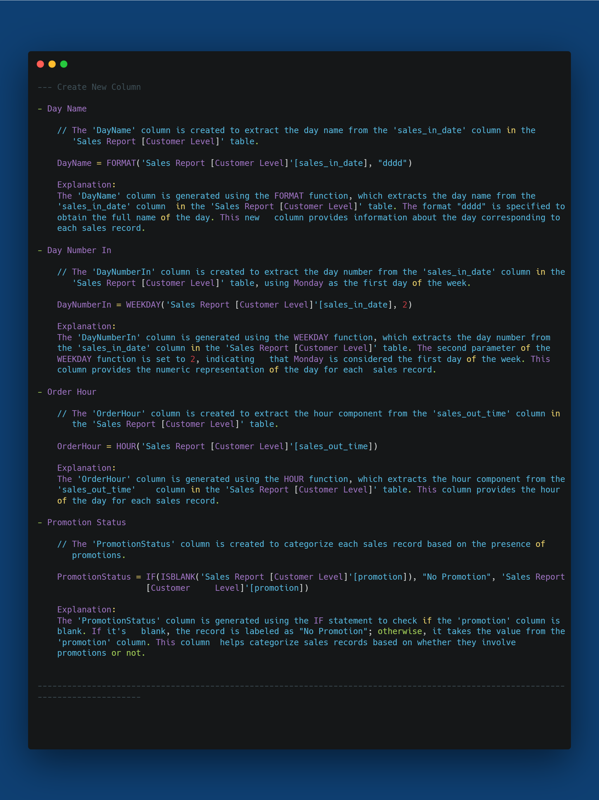

## Analyze & Visualization
Power BI was employed to design insightful dashboards, allowing stakeholders to explore the data visually. The analysis includes identifying customer preferences, peak ordering times, and menu performance.

### 1. Customer Data
   - Display total sales by customer name.
   - Present figures for total orders and total users, categorized by sales type.
   - Utilize visual cards to showcase total customers and total orders.
   - ncorporate a text-box to articulate insights derived from the gathered information.

### 2. Sales Report [Branch Level]
   - Implement filters for dates and branch names.
   - Utilize visual cards to illustrate the total bill and grand total.
   - Visualize time-series data for grand total and total bill in a single chart.
   - Explore the busiest times for orders through figures.
   - Compare grand totals for weekdays (Mon, Tues, Wed, Thurs) vs weekends (Fri, Sat, Sun).
   - Identify branches contributing the most to grand totals.
   - Integrate a text-box to document insights and recommendations based on the obtained information.

### 3. Sales Report [Menu Level]
   - Apply filters for arrival date, city, and destination.
   -  Illustrate figures indicating the quantity and revenue of frequently sold menu items.
   - Utilize a decomposition tree to showcase the hierarchy: category menu -> category detail menu -> menu.
   - isplay figures highlighting the contribution of each menu by revenue.
   - Utilize a scatter plot to investigate the correlation between cheaper menu prices and quantity.
   - Utilize a text-box to articulate insights and recommendations derived from the accumulated data.

### 4. Sales Report [Customer Level]
   - Implement filters for date, branch name, city, and purpose of visit.
   - Utilize visual cards to display sales orders and grand totals.
   - Visualize time-series data for grand total and total bill in a consolidated chart.
   - Present figures comparing orders with promotions vs. no promotions (excluding "*Open bill discount").
   - Showcase figures indicating high-contributing promotions not included without promotion, excluding "No Promotion" and "*Open bill discount."
   - Explore the busiest order times through figures.
   - ompare weekday grand totals (Mon, Tues, Wed, Thurs) vs weekend grand totals (Fri, Sat, Sun).
   - Identify branches contributing the most to grand totals.
   - Leverage a text-box to document insights and recommendations based on the gathered information.

### In this project there are 4 pages :
- Customer Data
- Branch Level
- Customer Level
- Detailed Menu

### You can interact with Report Here _[Novypro](https://www.novypro.com/project/food-story)_

## Conclusion & Recomendation

### The Food Story project successfully explored and analyzed sales data from various aspects, from branches to menu details. Here are some highlights of this project :

- Sales by Customer:

  Customers AMIN and Dennish Tjandra were the top orderers with a total of 24 orders, showing their significant contribution.

- Sales Type:

  Sales type "Delivery" recorded 270 orders from 174 users, while "Pick Up (Quick Service)" had 200 orders from 81 users.

- Total Customers and Orders:

  Customers totaled 244 with orders totaling 470, reflecting steady activity.

- Sales per Branch:

  Foodstory Sawah Besar was the branch with the highest contribution, contributing 4,244 M Rupiah.

- Busiest Time for Orders:

  The busiest orders occur from 9am to 8pm, peaking at 12pm and 6pm.

- Daily Grand Total:

  Monday and Friday are the days with the highest grand total contribution.

- Menu Sales Details:

  "Paket Lahab Special 1" menu reached the highest revenue of 572 M Rupiah with quantity of 17,691.

- Menu Category Analysis:

  "Chiken Pao" category dominates with total revenue of 3,046 M Rupiah, with "Crispy Chiken BBQ Sauce" and "Crispy Chiken Garlic Sauce" as the main contributors.

- Correlation between Price and Menu Quantity:

  There is a positive correlation between cheaper menu prices and quantity, indicating that cheaper menus tend to have higher quantity.

- Time-Series Grand Total and Total Bill:

  Sales trends show fluctuations, with some months recording significant grand total and total bills.

---------------------------------------------------------------------------------------------------------------------------------------------------------------------------------------------------

This project provided deep insights into Food Story's sales performance from various dimensions, providing a basis for better decision-making and business improvement strategies.
